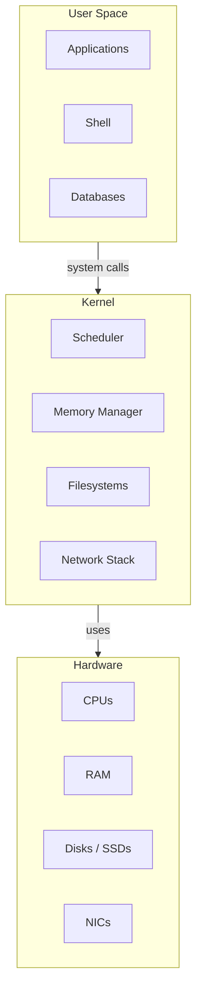

# 1.1 What Is an Operating System?

## Key Terms

- **Operating system (OS)**: The core software that sits between applications and hardware, deciding **which program runs when**, **what memory it uses**, and **how it talks to devices** (disks, network cards, etc).
- **Kernel**: The most privileged part of the OS that runs in **kernel mode** and has direct access to hardware. It implements process scheduling, memory management, device drivers, filesystems, and networking.
- **User space**: The environment where **normal programs** (shells, databases, web servers, tools) run. User-space code must ask the kernel for privileged operations via **system calls**.
- **Process**: A running instance of a program, with its own memory, open files, and execution state. Processes live in user space and rely on the kernel for CPU time, memory, and I/O.

---

## 1.1.1 Why Do We Need an Operating System?

At a very high level, an operating system is a **resource manager** and a **traffic controller**:

- Many programs want to use the **same CPU cores**.
- Many programs want to read and write the **same disks and network interfaces**.
- All programs need **memory** to store their code and data.

Without an OS, every program would have to:

- Drive hardware directly (know how to talk to the disk, NIC, keyboard, etc.).
- Compete with other programs with no rules or isolation.

The OS solves this by:

- **Abstracting hardware** behind simpler concepts:
  - Files instead of raw disk sectors.
  - Sockets instead of raw NIC registers.
- **Enforcing isolation and fairness**:
  - Each process gets its own address space.
  - The scheduler shares CPU time across processes.

From a performance engineering perspective, the OS is where **most resource decisions are made**. When a system is slow, it is often because:

- The OS is busy scheduling too many tasks.
- The OS is waiting on slow storage or network.
- The OS is enforcing limits (file descriptors, memory, cgroups, etc.).

---

## 1.1.2 The OS as a Layered Model

You can think of a Linux system as three main layers:

1. **Hardware** – CPUs, RAM, disks, NICs.
2. **Kernel** – Runs in kernel mode and directly controls hardware.
3. **User space** – Normal programs (your applications, tools, services).

Conceptually:



When you troubleshoot performance, you are almost always asking:

- **What is the kernel doing on the hardware?** (CPU, memory, I/O usage)
- **Which user-space processes are triggering that work?**

---

## 1.1.3 Main Responsibilities of an OS

An OS typically has five core responsibilities. Understanding these is enough to interpret many performance symptoms.

### 1. Process Management

- Create, schedule, and destroy **processes and threads**.
- Decide **which process runs on which CPU core and for how long**.

Performance angle:

- Too many runnable processes → high load, longer wait times.
- Misbehaving processes can starve others of CPU.

### 2. Memory Management

- Allocate and free memory for processes.
- Provide **virtual memory**, so each process believes it has its own address space.
- Use **page cache** to speed up disk I/O.

Performance angle:

- Memory pressure can cause swapping and latency spikes.
- Poor locality leads to cache misses and slower code.

### 3. Files and Storage

- Expose files and directories instead of raw disk blocks.
- Coordinate reads, writes, caching, and flushing to disk.

Performance angle:

- Slow disks or saturated I/O queues manifest as processes stuck in **D state** (uninterruptible sleep) and high I/O wait.

### 4. Networking

- Provide sockets and protocols (TCP, UDP, etc.).
- Manage packet queues, routing, congestion control.

Performance angle:

- High packet rates or drops can overload CPU cores handling interrupts and softirqs.

### 5. Device and Hardware Management

- Load and control **device drivers**.
- Expose controls and stats via interfaces like `/proc` and `/sys`.

Performance angle:

- Bad drivers or firmware can cause stalls, lockups, or poor throughput.

---

## 1.1.4 Why Performance Engineers Care About the OS

When a system is slow, three broad possibilities exist:

1. The **application code** is inefficient.
2. The **OS is making expensive choices** (e.g., frequent context switches, heavy I/O, contention).
3. The **hardware is saturated or misconfigured**.

The OS is where you:

- Observe **who is using CPU**, memory, disk, and network.
- See **where time is spent** (user vs kernel, I/O vs compute).
- Tune policies (schedulers, queues, limits).

Throughout the rest of this curriculum, you will repeatedly come back to the idea that:

> Performance engineering is about understanding **how the OS mediates between applications and hardware**, then adjusting either side (or both) to meet your goals.

---

## 1.1.5 Hands-On: Seeing the OS in Action

Run these on a non-production Linux system.

### Step 1 – See the OS Name and Kernel Version

```bash
uname -a
cat /etc/os-release 2>/dev/null || grep . /etc/*-release 2>/dev/null
```

Questions:

- Which Linux distribution and version are you on?
- What kernel version is running?

### Step 2 – See Hardware Under OS Control

```bash
lscpu | head
free -h
df -hT | head
```

Map each command to an OS responsibility:

- `lscpu` → CPU details (process management, scheduling).
- `free -h` → Memory (memory management).
- `df -hT` → Filesystems (storage management).

### Step 3 – Observe Processes

```bash
ps aux --sort=-%cpu | head
```

Questions:

- Which processes are consuming the most CPU?
- What kinds of programs are they (shells, servers, utilities)?

This is your first glimpse of the OS **arbitrating resources** among many processes.

---

## Beginner Checklist

By the end of this chapter, you should be able to:

- [ ] Explain, in your own words, what an operating system does.
- [ ] Name the main hardware resources the OS manages (CPU, memory, storage, network).
- [ ] Describe why OS behavior matters for performance.
- [ ] Give at least one example of how the OS can become a bottleneck (e.g., CPU saturation, I/O wait).
