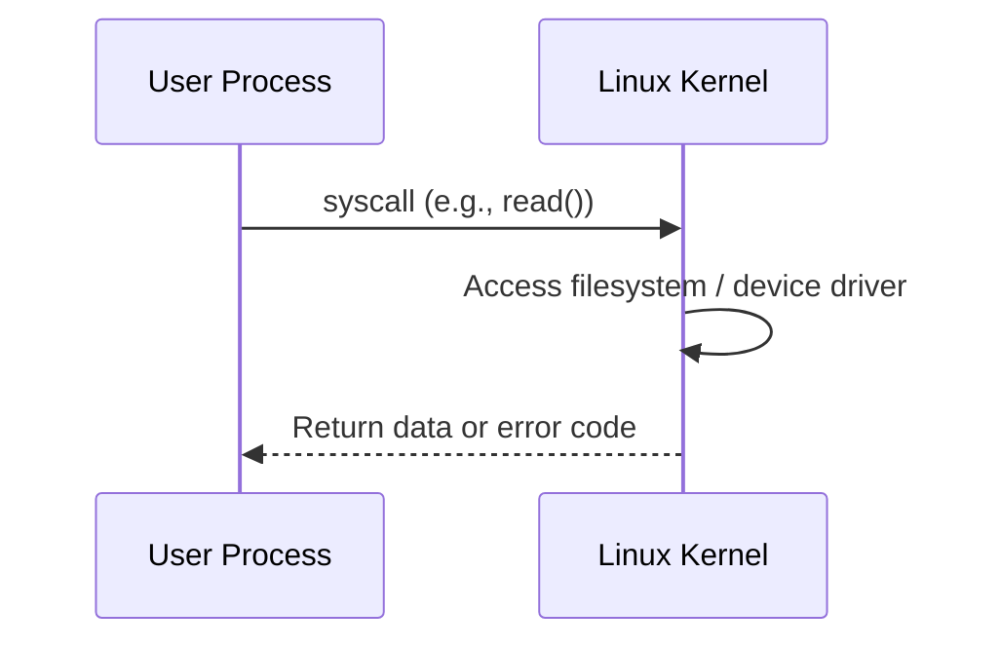

# 1.4 Introduction to Linux

## Purpose and Scope

This document introduces Linux from a **performance engineering** perspective. It focuses on:

- **What Linux is architecturally** (monolithic kernel, user space vs kernel space).
- **How applications interact with the kernel** via system calls.
- **Where time and resources are spent** when your workload runs.

It is intended for engineers who will later dive into CPU, memory, networking, storage, and kernel tuning, and need a solid mental model first.

Throughout the text you will find:

- **Commands with expected output patterns** and how to interpret them.
- **Failure scenarios** and how they surface in logs and metrics.
- **Exercises** you can run on a non-production Linux host.
- References to helper scripts under `scripts/` to make experiments reproducible.

---

## 1.4.1 What Is Linux?

At a high level, a Linux system is composed of:

- **Hardware**: CPU, memory, storage, NICs.
- **Kernel**: A privileged program that manages hardware and provides abstractions.
- **User space**: Processes such as shells, daemons, databases, and your applications.

From a performance viewpoint, Linux is the **mediator** between your application and hardware. Almost everything expensive (CPU time, disk I/O, network I/O, memory allocation) is ultimately performed by the kernel on behalf of user-space processes.

### High-Level Architecture

```mermaid
flowchart TB
    subgraph HW[Hardware]
        CPU[CPUs]
        MEM[RAM]
        DISK[Disks / SSDs]
        NIC[NICs]
    end

    subgraph K[Linux Kernel (ring 0)]
        SCHED[Scheduler]
        MM[Memory Manager]
        VFS[VFS & Filesystems]
        NET[Network Stack]
        DRV[Device Drivers]
    end

    subgraph U[User Space (ring 3)]
        APP[Applications]
        DAEMONS[Daemons & Services]
        SHELL[Shell & Tools]
    end

    U -->|syscalls| K
    K -->|uses| HW
```

Performance engineering on Linux largely boils down to **observing and influencing the behavior** of these kernel subsystems as they serve user-space workloads.

---

## 1.4.2 Monolithic vs Microkernel vs Hybrid

Operating systems organize their core functionality differently:

- **Monolithic kernels**: Most OS services (scheduling, memory, filesystem, network, drivers) live in a single, privileged address space.
- **Microkernels**: Only minimal services (IPC, low-level scheduling) live in the kernel; others run as user-space servers.
- **Hybrid kernels**: Marketing term for designs that combine aspects of both.

Linux is a **monolithic kernel** with support for **loadable kernel modules** (LKMs). In performance terms, this means:

- Transitions between kernel subsystems are **function calls** inside one address space (fast, but failures are catastrophic).
- A bug in a driver or key subsystem can **crash or stall the whole system**.
- You gain **high performance and flexibility**, at the cost of needing good observability into kernel internals.

**Implication for incidents:**

- A faulty NIC driver, filesystem bug, or misbehaving kernel module can cause system-wide CPU softlockups, hangs, or panics.
- You often need to inspect **kernel logs (`dmesg`) and `/proc`** to understand failures.

---

## 1.4.3 Kernel Space vs User Space

Linux uses the CPU’s privilege levels to separate **kernel space** from **user space**:

- **Kernel space** (ring 0): Full hardware access, runs the kernel and its modules.
- **User space** (ring 3): Regular processes, constrained by the kernel.

### Why This Matters for Performance

1. **Different failure domains**:
   - A crash in user space kills a process.
   - A serious bug in kernel space can freeze the machine or trigger a panic.

2. **Context switch cost**:
   - Moving from user to kernel mode and back (via a syscall) has overhead.
   - High syscall rates or frequent blocking operations can significantly impact latency and CPU usage.

3. **Different visibility**:
   - User-space issues are usually visible via process metrics (`ps`, `top`, `pidstat`).
   - Kernel-space issues are visible via `/proc`, `/sys`, and logs (`dmesg`, `/var/log/*`).

### Visualizing Transitions



Each arrow represents:

- A **mode switch** (user → kernel → user).
- Potential **CPU pipeline flushes** and **TLB effects**.
- Contention on locks, queues, or hardware resources.

---

## 1.4.4 System Calls Overview

Applications cannot access hardware directly; they call into the kernel using **system calls (syscalls)**.

Examples:

- `read`, `write`, `open`, `close` for files and sockets.
- `socket`, `connect`, `sendto`, `recvfrom` for networking.
- `fork`, `execve`, `clone` for processes and threads.

On modern x86-64 Linux, syscalls are typically implemented via the `syscall` instruction, which switches the CPU from user mode to kernel mode.

### Inspecting Syscalls with `strace`

You can trace system calls of a process using `strace`.

```bash
strace -c ls /tmp
```

`-c` summarizes syscall usage. Typical output pattern:

```text
% time     seconds  usecs/call     calls    errors syscall
------ ----------- ----------- --------- --------- ----------------
 40.00    0.000120           6        20           getdents64
 30.00    0.000090           9        10           stat
 ...
```

Interpretation:

- `calls`: how often each syscall was invoked.
- `seconds` / `% time`: where your process spent time in kernel mode.

If an application is slow and `strace -c` shows large time in `read` or `fsync`, you should suspect **I/O latency** rather than CPU limits.

> The helper script `scripts/section01-04-introduction-to-linux-basics.sh` automates several of these checks.

---

## 1.4.5 Observing the Running Kernel

At this stage, you don’t need deep kernel internals yet, but you should know which tools tell you **what kernel you’re on** and **what hardware it manages**.

### Kernel and OS Identification

```bash
uname -a
cat /etc/os-release 2>/dev/null || grep . /etc/*-release 2>/dev/null
```

Key fields:

- `Linux` + kernel version (e.g., `5.15.0-xyz`): Relevant for knowing which features and bugs you may hit.
- Distribution and release: Impacts defaults (sysctl, systemd version, cgroup implementation).

### CPU and Memory Overview

```bash
lscpu | egrep 'CPU\(|Thread|Core|Socket|NUMA'
free -h
```

You’ll use this information later when reasoning about **NUMA locality**, **CPU saturation**, and **memory pressure**.

### Filesystems and Mount Options

```bash
mount | head
df -hT
```

Mount options (e.g., `noatime`, `barrier=1`) and filesystem types (`ext4`, `xfs`, `btrfs`) have direct performance consequences, especially under I/O-heavy workloads.

---

## 1.4.6 Typical Failure Scenarios at This Level

These problems frequently arise in production and are easier to diagnose with the concepts above.

- **Kernel panics**: Often visible via console messages, `dmesg`, or crash dumps if configured. The entire system reboots or hangs.
- **Softlockups / Hardlockups**: CPU cores appear stuck in kernel mode, watchdogs emit warnings. Load average spikes, but useful work stalls.
- **Driver or firmware issues**: NIC or storage drivers emit repeated errors (e.g., I/O timeouts), leading to high latency or packet loss.

At this “introductory” level, you should at least know **where to look**:

- Logs: `dmesg`, `/var/log/messages`, `/var/log/syslog` (varies by distro).
- Kernel state: `/proc` and `/sys` (covered in detail in section 1.3).

---

## 1.4.7 Hands-On Exercises

Run these on a **test system** or a disposable VM, not on a critical production host.

### Exercise 1 – Inspect Basic System Properties

1. Run:
   ```bash
   uname -a
   lscpu | head
   free -h
   df -hT | head
   ```
2. Note:
   - Kernel version, architecture, and distribution.
   - Number of CPUs and threads.
   - Total/used memory and swap.
   - Filesystem types and mount options.

**Hint / Expected observations:**

- Many modern systems show `x86_64`, multiple cores, and a 5.x kernel series.
- Filesystems are often `ext4` or `xfs` for general-purpose servers.

### Exercise 2 – Visualize Syscall Activity for a Simple Command

1. Run:
   ```bash
   strace -c ls /tmp
   ```
2. Record which syscalls dominate in `% time` and `calls`.
3. Consider:
   - What would happen to performance if each `getdents64` or `stat` became slower (e.g., due to slow storage or NFS latency)?

### Exercise 3 – Use the Helper Script

This repository provides a helper script for this section:

```bash
bash scripts/section01-04-introduction-to-linux-basics.sh
```

The script:

- Prints kernel, CPU, memory, and filesystem summaries.
- Runs a short `strace -c` on `ls`.
- Leaves the system in a clean state (no long-running processes).

Review its output and map each piece back to the concepts in this document.

---

## 1.4.8 Beginner Checklist

By the end of this chapter, you should be able to:

- [ ] Describe Linux as a **monolithic kernel** with separate **kernel space** and **user space**.
- [ ] Explain how **system calls** mediate all privileged operations.
- [ ] Use `uname`, `lscpu`, `free`, and `df` to obtain a high-level performance context for a machine.
- [ ] Use `strace -c` to get a **first approximation of where time is spent** inside the kernel for a simple process.

These foundations are critical for the next topics in Section 01:

- **1.5 Processes, Scheduling & System Services** – How Linux decides which threads run on which CPUs and how services are managed.
- **1.6 Filesystem Layout & Kernel-Relevant Paths** – Where the kernel exposes state and where logs and diagnostics live.
