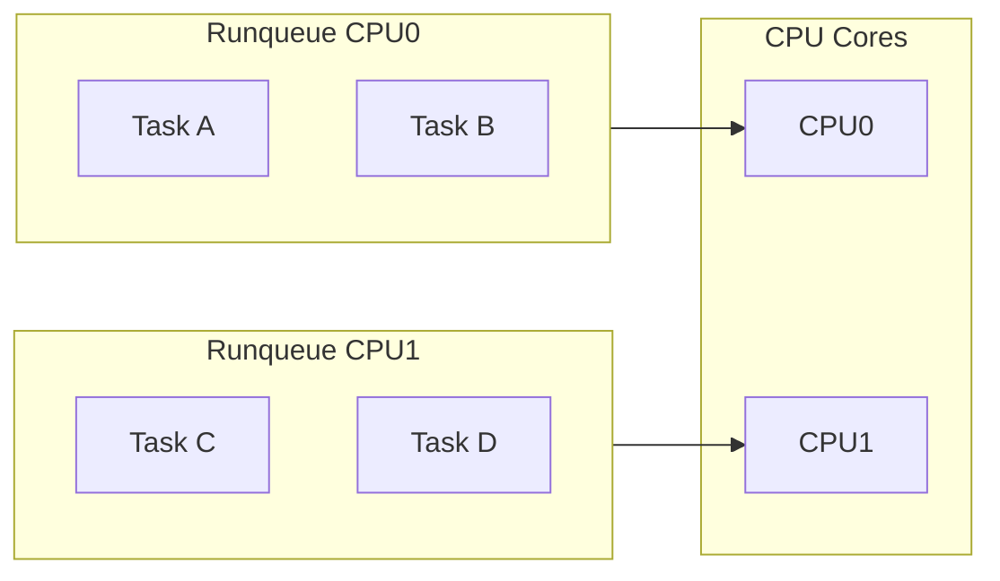

# 1.5 Processes, Scheduling & System Services

## Purpose and Scope

This document explains how Linux executes programs, schedules CPU time, and manages long-running system services. You will learn:

- How processes are created and destroyed.
- How basic scheduler behavior affects **latency** and **throughput**.
- How `systemd` manages services and what happens when they fail.
- Which commands and metrics to inspect when CPU saturation or service outages occur.

We will not yet go deep into the Completely Fair Scheduler (CFS) internals; that comes later. Here we build a **practical mental model**.

---

## 1.5.1 Process Lifecycle

Every running program on Linux is represented by a **process** (or thread) with an associated **PID** and state.

Typical lifecycle:

1. **Creation**
   - A process calls `fork()` or `clone()` to create a child.
   - The child often calls `execve()` to replace its memory image with a new program.

2. **Running / Waiting**
   - The process alternates between **running on a CPU** and being **blocked** (e.g., on I/O, locks, timers).

3. **Termination**
   - The process exits normally (returns from `main` or calls `_exit()`), or abnormally (signal, crash).
   - The parent calls `wait()` / `waitpid()` to collect the exit status.

### Process States

Common states visible in tools like `ps` and `top`:

- `R` – **Running / Runnable**: on CPU or ready to run.
- `S` – **Sleeping**: waiting for an event (e.g., I/O completion).
- `D` – **Uninterruptible Sleep**: usually waiting on I/O; excessive `D` often indicates storage or NFS issues.
- `Z` – **Zombie**: process has exited but parent has not called `wait()`.

Performance implications:

- Many `R` tasks with high CPU usage → CPU saturation.
- Many `D` tasks → external bottleneck (typically **disk or network**).

### Inspecting Processes

```bash
ps aux --sort=-%cpu | head
ps aux --sort=-%mem | head
```

Key columns:

- `%CPU`: fraction of a single CPU core.
- `STAT`: process state (`R`, `S`, `D`, `Z`, etc.).
- `COMMAND`: what is running; useful for mapping back to services.

---

## 1.5.2 Linux Scheduling (High-Level)

Linux uses several schedulers; the default for normal processes is the **Completely Fair Scheduler (CFS)**.

Goals of CFS (simplified):

- Give each runnable task a **fair share** of CPU time,
  weighted by its **nice level**.
- Maintain **low latency** when there is little contention.
- Scale to many CPUs and tasks.

You will learn the detailed mechanics later; for now, remember:

- The scheduler maintains **per-CPU runqueues** of runnable tasks.
- It periodically picks a task to run, based on accumulated **virtual runtime**.
- Higher `nice` (positive values) → less CPU share; lower `nice` (negative) → more share.

### Scheduling and Load Average

Linux load average (from `uptime` or `top`) is roughly the **average number of runnable and uninterruptibly sleeping tasks** over a time window.

```bash
uptime
```

Example output:

```text
 16:30:00 up 1 day,  5:12,  2 users,  load average: 0.25, 0.40, 0.35
```

On a 4-core machine:

- Load average ≈ 4 means all CPUs are fully utilized.
- Load average ≫ number of CPUs means **contention**: many tasks are waiting for CPU or stuck in I/O.

### Visualizing Scheduling at a High Level



Under contention, runqueues become long, and tasks wait longer to get CPU time → **higher latency**.

---

## 1.5.3 Systemd & Service Management

Most modern Linux distributions use **systemd** as the init system and service manager.

Roles of `systemd` in performance engineering:

- Defines **how services start**, under which user, with which resource limits.
- Controls **restart policies** (e.g., auto-restart crash-looping services).
- Orders **dependencies** between units, which can affect startup latency.

### Inspecting Services

List all services and their states:

```bash
systemctl list-units --type=service --no-pager
```

Show the status of a specific service:

```bash
systemctl status sshd.service --no-pager
```

Typical output elements:

- **Loaded**: Unit file path and whether it is enabled.
- **Active**: `active (running)`, `failed`, `activating`, etc.
- **Main PID**: Main process ID of the service.
- Recent **logs** from the unit’s journal.

### Debugging a Failing Service

When a service performs poorly or fails to start:

1. Check its unit status:
   ```bash
   systemctl status myservice.service --no-pager
   ```
2. Inspect recent logs:
   ```bash
   journalctl -u myservice.service -n 50 --no-pager
   ```
3. Correlate with CPU and memory usage:
   ```bash
   ps aux | grep myservice | grep -v grep
   ```

Performance angle:

- Misconfigured resource limits (e.g., `LimitNOFILE`, `TasksMax`) can lead to errors under load.
- Services that crash loop may create **spiky load** and noisy logs.

---

## 1.5.4 Failure Scenarios and How They Manifest

### Scenario A – CPU Starvation

Symptoms:

- High load average (`uptime`).
- `top` shows several processes near 100% CPU each on a multi-core system.
- Latency for other workloads increases; interactive shells feel sluggish.

Relevant observations:

- Check `top` or `htop` for which processes consume CPU.
- Use `pidstat 1` (from `sysstat` package) to inspect per-process CPU over time.

Interpretation:

- CPU time is the bottleneck; the scheduler is fairly sharing CPU but there is more demand than supply.

### Scenario B – I/O Wait Disguised as High Load

Symptoms:

- High load average, but `top` shows many tasks in `D` state.
- `iostat -x 1` (later chapter) shows high disk utilization and long await times.

Interpretation:

- Tasks are blocked in the kernel waiting for I/O, not competing for CPU.
- Scheduler cannot fix this; you must address **storage or network latency**.

### Scenario C – Service Crash Loop

Symptoms:

- A systemd service keeps transitioning between `activating` and `failed`.
- `systemctl status` shows repeated restarts.
- Logs (`journalctl -u`) show errors (e.g., out-of-memory, permission denied, misconfig).

Performance impact:

- Repeated process creation and teardown.
- Potential disk and CPU overhead from logs and failed initialization.

---

## 1.5.5 Hands-On Exercises

These exercises use both manual commands and the helper script `scripts/section01-05-processes-and-scheduling.sh`.

### Exercise 1 – Observe Normal CPU Scheduling

1. Run:
   ```bash
   top -H -d 1
   ```
2. In another terminal, run a simple CPU-bound loop (or let the helper script do this for you).
3. Watch how CPU usage per thread changes over time.

**Hints / Expected observations:**

- On an idle machine, your loop should quickly take near-100% of one CPU.
- On a busy machine, it competes with other tasks; each gets a share.

### Exercise 2 – Inspect Process States

1. In one terminal, start a process that sleeps:
   ```bash
   sleep 300 &
   ```
2. Run:
   ```bash
   ps -o pid,ppid,stat,cmd -p $!
   ```
3. Note that the state is usually `S` (sleeping).

Then:

1. Start a process performing disk I/O (e.g., using `dd` on a large file or rely on future storage exercises).
2. While it runs, observe its state with `ps` or `top`.

**Expected pattern:** some periods in `D` during blocking I/O.

### Exercise 3 – Use the Helper Script

Run:

```bash
bash scripts/section01-05-processes-and-scheduling.sh
```

The script will:

- Launch a short-lived CPU-bound background workload.
- Show `ps` and `top` snapshots focusing on that workload.
- Clean up the background processes before exiting.

Interpret the output:

- Relate CPU usage to load average.
- Check the process states (`R`, `S`) during CPU-bound vs sleeping phases.

### Exercise 4 – Inspect a Systemd Service

Pick a safe service, e.g. `cron` or `sshd` (adjust name per distro):

```bash
systemctl status sshd.service --no-pager
journalctl -u sshd.service -n 20 --no-pager
```

Questions:

- What is the **Main PID**?
- How long has the service been running?
- Any repeated warnings or errors?

---

## 1.5.6 Beginner Checklist

By the end of this chapter, you should be able to:

- [ ] Describe the **process lifecycle** from creation to termination.
- [ ] Recognize key **process states** and their performance implications.
- [ ] Explain at a high level how the **scheduler** shares CPU time between tasks.
- [ ] Use `systemd` tools to inspect **service health** and recent logs.
- [ ] Run small experiments that create CPU load and interpret their impact on load average and responsiveness.
