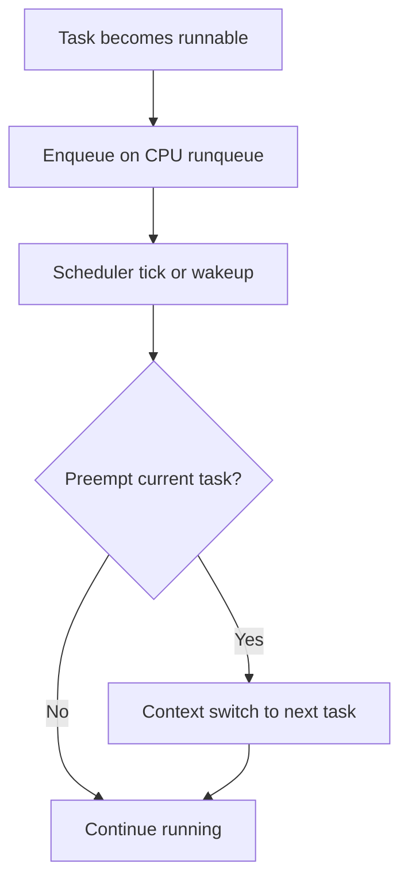

# 2.2 Context Switching & Kernel Scheduling

This document explains how Linux decides *which* task runs *where* and *when*, and what it costs to move CPU time between tasks. You will learn how to spot high context-switch rates, runqueue contention, and scheduling imbalances, and how to reason about their performance impact.

---

## 2.2.1 Key Terms

- **Context switch**  
  The act of stopping one task on a CPU and starting another, saving and restoring CPU state.

- **Runqueue**  
  A per-CPU (or per-core) queue of runnable tasks waiting for CPU time.

- **Contention**  
  Competition between tasks for a shared resource (like CPU time, a lock, or I/O), causing delays as tasks wait their turn.

- **Scheduler**  
  Kernel component that decides which task to run next on each CPU based on policy and priority.

- **Timeslice**  
  The amount of virtual time a runnable task is allowed to run before the scheduler may preempt it.

- **Preemption**  
  Forcibly interrupting a running task so another can run, often due to priority or timeslice expiration.

- **Load average**  
  A rolling average of runnable and uninterruptibly blocked tasks; often used as a rough pressure indicator.

- **CFS (Completely Fair Scheduler)**  
  The default Linux scheduler for normal tasks; it tries to distribute CPU time fairly according to weights.

Each of these terms appears again in the sections that follow, with concrete command outputs and interpretations.

---

## 2.2.2 What Is a Context Switch?

At any moment, a CPU can execute instructions from exactly one task (per hardware thread). When the kernel decides to run a different task, it performs a **context switch**:

- Save the current task’s CPU state (registers, program counter, stack pointer).
- Load the next task’s CPU state.
- Update accounting structures so the scheduler knows who is running.

Analogy:

- Think of a single desk where different people can work.
- A context switch is when one person stands up, carefully packs their papers, and another person unpacks theirs and sits down.
- Frequent switching means lots of time packing and unpacking instead of getting work done.

Context switches are necessary for multitasking, but they have a cost:

- Direct overhead: kernel work to save/restore state.
- Indirect overhead: loss of cache and TLB locality when switching between unrelated tasks.

You can see context switch rates with `vmstat` or `pidstat`:

```bash
vmstat 1
```

Sample output:

```text
procs -----------memory---------- ---swap-- -----io---- -system-- ------cpu-----
 r  b   swpd   free   buff  cache   si   so    bi    bo   in   cs us sy id wa st
 1  0      0 4050300 185200 2850100    0    0     2    14  250  650  5  2 92  1  0
 2  0      0 4048200 185200 2850200    0    0     0     0  840 1200 15  5 80  0  0
 6  0      0 4045100 185210 2850300    0    0     0    45 1500 4500 30 15 55  0  0
```

Look at the `cs` column (context switches per second). In the sample above, notice how `cs` jumps from **1200** to **4500** as the number of runnable tasks (`r`) rises from 2 to 6. This spike indicates the scheduler is working much harder to juggle the extra tasks, which can increase latency.

---

## 2.2.3 The Linux Runqueue and Scheduling Cycle

Each CPU has a **runqueue** holding tasks that are ready to run (not blocked on I/O, sleeping, etc.). The scheduler periodically chooses the “best” task to run next from that queue, based on policy and priority.

Simplified view of the scheduling loop:



Important points:

- The runqueue is per CPU, but tasks can be migrated between CPUs for balancing.
- Preemption can occur when:
  - A higher-priority task wakes up.
  - The current task exhausts its timeslice.
  - The scheduler decides to rebalance load across CPUs.

From a performance perspective, long or heavily loaded runqueues can cause:

- **Increased latency**: Tasks wait longer before getting CPU time.
- **I/O bottlenecks**: Even if disks are fast, if the CPU can't schedule the task to process the data, throughput drops.
- **Higher context-switch cost**: More time spent in the kernel management overhead.

You can inspect runqueue length with `vmstat` (`r` column) or `ps` by counting runnable tasks.

---

## 2.2.4 The Completely Fair Scheduler (CFS) in Plain Terms

Linux’s default scheduler for normal tasks is the **Completely Fair Scheduler (CFS)**. Its goal is to share CPU time “fairly” between runnable tasks, weighted by priority (niceness).

Plain-language model:

- Imagine a line of people waiting to use a single treadmill.
- Each person has a ticket with a weight (priority).
- The attendant tries to ensure that over time, each person gets treadmill time proportional to their weight.

Technical sketch (just enough detail):

- Each task has a **virtual runtime**: how much CPU time it has effectively consumed.
- The scheduler chooses the task with the **smallest** virtual runtime to run next.
- Heavier tasks (lower priority, lower weight) accumulate virtual time faster, so they yield the CPU sooner.

Niceness and priority details are covered more deeply in `11.1-nice-and-cpu-priority.md`, but for now you only need to remember:

- Lower nice value (e.g., `-5`) → higher weight → more CPU share.
- Higher nice value (e.g., `+10`) → lower weight → less CPU share.

The key performance effect is: the scheduler is constantly trading off fairness and responsiveness. Too many runnable tasks competing for CPU time can lead to high context-switch rates and unpredictable latency.

---

## 2.2.5 Measuring Context Switches and Scheduling Overhead

Use `vmstat` to monitor global context-switch activity:

```bash
vmstat 1
```

Relevant fields:

- **r**  
  Number of runnable tasks (runqueue length) at each sample.

- **cs**  
  Number of context switches per second.

Sample output (abridged):

```text
procs -----------memory---------- ---swap-- -----io---- -system-- ------cpu-----
 r  b   swpd   free   buff  cache   si   so    bi    bo   in   cs us sy id wa st
 1  0      0 500000  20000 200000    0    0     1     2  100  300 10  5 85  0  0
 4  0      0 480000  21000 205000    0    0    10    20  500 2000 70 20 10  0  0
```

Interpretation:

- First line: relatively idle system (`cs` ~300/s).
- Second line: more runnable tasks (`r`=4) and `cs` jumps to 2000/s.

High `cs` values can be harmless on busy servers, but if they appear alongside latency complaints or CPU saturation, investigate:

- Too many short-lived tasks.
- Aggressive thread pools creating excessive concurrency.
- Misconfigured services that spawn many workers competing for limited cores.

For per-process context switches, use `pidstat`:

```bash
pidstat -w 1
```

Sample output:

```text
Linux 5.15.0-generic (server) 	11/26/2023 	_x86_64_	(4 CPU)

10:15:01      UID       PID   cswch/s   nvcswch/s  Command
10:15:02     1000      3450      20.00        1.00  postgres
10:15:02     1000      8891   15000.00       15.00  redis-server
10:15:02     1000      9902       5.00     2500.00  ffmpeg
```

**Key Columns:**

- **cswch/s (Voluntary Context Switches):**
  - The task **voluntarily** gave up the CPU (e.g., waiting for disk I/O, network packets, or a lock).
  - High rates (like `redis-server` above) often point to I/O-bound workloads or heavy lock contention (waiting).

- **nvcswch/s (Non-Voluntary Context Switches):**
  - The task was **forced** off the CPU by the scheduler (e.g., its timeslice expired or a higher-priority task woke up).
  - High rates (like `ffmpeg` above) indicate the process is CPU-bound and effectively saturating its allocated CPU time.

---

## 2.2.6 Load Average and Runqueue Pressure

Linux **load average** is often misunderstood. It is *not* a pure “CPU usage” metric; instead, it reflects **the average number of tasks** over time that are:

- Runnable (on the runqueue), or
- In uninterruptible sleep (typically waiting on I/O).

You can see load average via:

```bash
uptime
```

Example:

```text
 15:34:07 up 10 days,  4:12,  2 users,  load average: 0.30, 1.20, 2.50
```

Interpretation:

- `0.30`: 1-minute average.
- `1.20`: 5-minute average.
- `2.50`: 15-minute average.

**On a single-CPU system:**

- Load ~1 means roughly one runnable/uninterruptible task on average.
- Load ~2 means more tasks than CPUs; some must wait.

**How is it calculated? (Simplified Arithmetic)**

Think of it as checking the line at a grocery store **with a single checkout lane** (representing 1 CPU) every 5 seconds.
If you check 12 times in a minute (12 samples):

- **Sample 1:** 1 person in line.
- **Sample 2:** 0 people in line.
- **Sample 3:** 2 people in line.
...
- **Sample 12:** 0 people in line.

If the total count of people seen across all 12 samples is **6**, the average is:

`6 (total count) / 12 (number of samples) = 0.50`

This means, on average, there was **half a person** (0.5) using or waiting for the checkout.

**Interpreting Load vs. CPU Count:**

- **Load 1.0 on 1 CPU:** The CPU is fully utilized but not overloaded. (This means there is 1 task running on average, so the CPU has exactly one task to execute).
- **Load 4.0 on 4 CPUs:** All CPUs are fully utilized; no waiting yet. (This means there are 4 tasks running on average, so each of the 4 CPUs has exactly one task to execute).
- **Load 0.25 on 4 CPUs:** The system is mostly idle. (On average, 0.25 tasks are runnable. This consumes roughly 25% of **one** CPU's capacity, but distributed across **4** CPUs, the total system is 6.25% utilization or 93.75% idle).
- **Load 20.0 on 4 CPUs:** Heavy contention; tasks are waiting 4-5x longer than they should.

Always interpret load in the context of:

- Number of logical CPUs (`lscpu`).
- CPU utilization breakdown (`top`, `%us`, `%sy`, `%wa`).

---

## 2.2.7 Scheduling Imbalance and CPU Affinity

Sometimes, tasks cluster on a small subset of CPUs while others remain idle. This can happen due to:

- Application-level affinity settings:
  - **Taskset**: Linux command to change the CPU affinity of a running process. It allows you to pin a process to specific CPUs or cores.
  - **Thread pinning**: A technique used by some applications to explicitly control which CPU (or core) a thread runs on. This is often done for performance reasons. Thread pinning can be achieved by setting the CPU affinity of a thread using `taskset` or by using the `pthread_setaffinity_np` system call in C/C++.
- Kernel scheduler decisions and topology preferences.

You can inspect per-CPU usage with `mpstat` (from `sysstat`):

```bash
mpstat -P ALL 1
```

Sample output:

```text
11:09:56 PM  CPU    %usr   %nice    %sys %iowait    %irq   %soft  %steal  %guest  %gnice   %idle
11:09:57 PM  all    7.68    0.00    2.14    2.02    0.76    0.50    0.00    0.00    0.00   86.90
11:09:57 PM    0    5.05    0.00    2.02    0.00    1.01    1.01    0.00    0.00    0.00   90.91
11:09:57 PM    1    8.00    0.00    4.00   11.00    0.00    1.00    0.00    0.00    0.00   76.00
11:09:57 PM    2    3.03    0.00    1.01    0.00    1.01    1.01    0.00    0.00    0.00   93.94
11:09:57 PM    3   11.22    0.00    0.00    1.02    1.02    0.00    0.00    0.00    0.00   86.73
```

Look for:

- **Imbalance:** Compare the `%idle` column across CPUs. If some CPUs are near 0% idle while others are near 100%, the workload is unevenly distributed.
- **Single-Threaded Saturation:** If one CPU is stuck at 0% idle (100% busy) and the others are idle, a single-threaded application may be the bottleneck.

If needed, you can adjust affinity of a process:

```bash
# Pin PID 1234 to logical CPUs 0 and 1
taskset -cp 0,1 1234
```

Be careful: manual pinning can improve cache locality but also make imbalance worse if overused or misapplied.

---

## 2.2.8 Hands-On Exercise: Creating a Context Switch Storm

> **Warning:** Run this only on a non-production system. It will briefly increase context-switch rates and CPU usage.

Associated script: `scripts/section02-02-context-switching-demo.sh`.

Run it as:

```bash
bash scripts/section02-02-context-switching-demo.sh
```

In another terminal, observe:

- `vmstat 1`  
  Watch `r` (runqueue length) and `cs` (context switches per second) increase while the script runs.

- `pidstat -w 1`  
  Identify which PIDs have a high rate of context switches.

Questions to explore:

- How does increasing the number of worker processes in the script affect `cs` and latency?
- At what point does the system feel sluggish (e.g., shell responsiveness)?

This exercise makes the otherwise invisible cost of scheduling and context switching concrete and observable.

---

## 2.2.9 Beginner Checklist

- [ ] I can explain, in plain language, what a context switch is and why it has a cost.
- [ ] I can use `vmstat 1` to observe runqueue length (`r`) and context switches (`cs`).
- [ ] I can describe what the Linux runqueue is and how it relates to load average.
- [ ] I can interpret load average correctly relative to the number of logical CPUs.
- [ ] I can run `section02-02-context-switching-demo.sh` and correlate its behavior with `vmstat` and `pidstat` output.
- [ ] I can recognize symptoms of scheduling imbalance using `mpstat -P ALL`.
