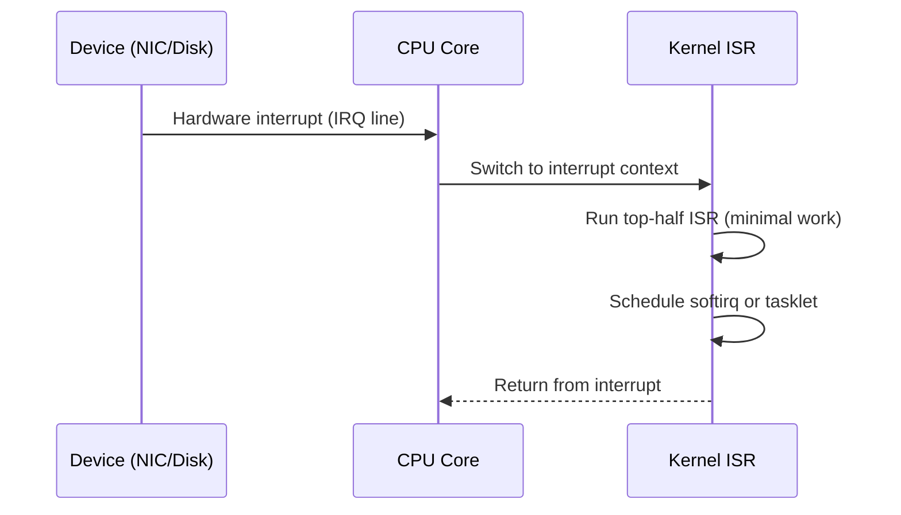

# 2.3 Interrupt Handling & IRQ Mechanisms

This document explains how hardware devices get the CPU’s attention using interrupts, how Linux handles them, and how interrupt-heavy workloads can affect performance.

You will learn to read `/proc/interrupts`, recognize interrupt hotspots, and relate them to network and disk activity.

---

## 2.3.1 Key Terms

- **Interrupt (IRQ)**  
  A hardware signal that tells the CPU to pause current work and handle an event, such as incoming network packets or disk I/O completion.

- **Interrupt handler (ISR)**  
  Kernel function that runs in response to an interrupt; it performs minimal work and often defers more work.

- **Softirq**  
  A deferred kernel mechanism for handling work that was triggered by interrupts but can run later at lower priority.

- **IRQ affinity**  
  Mapping that controls which CPUs handle which interrupts.

- **Interrupt storm**  
  A situation where an excessive number of interrupts floods the system, consuming significant CPU and causing latency.

- **NAPI (New API)**  
  A Linux network driver mechanism that reduces interrupt load by polling under high packet rates.

These concepts show up directly in `/proc/interrupts` and in CPU utilization patterns during heavy I/O or network traffic.

---

## 2.3.2 What Is an Interrupt?

Without interrupts, the CPU would have to constantly poll devices:

- “Do you have data for me now? Now? What about now?”

Interrupts reverse the relationship:

- Devices notify the CPU only when something important happens.

Analogy:

- Polling: you repeatedly call a friend every minute to ask if they have news.
- Interrupt: your friend calls you when there is actual news.

In Linux, an interrupt typically follows this flow:



The “top half” (ISR) runs quickly to acknowledge the hardware. The “bottom half” (softirq, tasklet, or kthread) handles heavier work later.

---

## 2.3.3 Inspecting /proc/interrupts

Linux exposes interrupt statistics in `/proc/interrupts`:

```bash
head -n 20 /proc/interrupts
```

Example snippet (simplified):

```text
           CPU0       CPU1       CPU2       CPU3
 24:    1234567    2345678    3456789    4567890   IO-APIC  24-fasteoi  eth0
 25:      12345      23456      34567      45678   IO-APIC  25-fasteoi  ahci[0000:00:17.0]
 NMI:        10         12         11         13   Non-maskable interrupts
 LOC:   6789012   6789020   6789030   6789040   Local timer interrupts
```

Interpretation:

- The first row labels CPUs (CPU0..CPU3).
- Each subsequent line corresponds to an interrupt source.
- Numeric column per CPU: how many interrupts that CPU has handled for this source.
- Right-most fields: interrupt controller, type, and associated device/driver.

In the example:

- Line `24` corresponds to `eth0` (a network interface).
- We see interrupts distributed across CPUs 0–3, but not necessarily evenly.

From a performance standpoint:

- A very hot network or storage interrupt line concentrated on a single CPU can saturate it.
- You may see high `%si` (softirq) or `%irq` time in `top` and one CPU pegged in `mpstat -P ALL`.

---

## 2.3.4 IRQ Affinity and Balancing

**IRQ affinity** controls which CPUs are allowed to handle a given interrupt. On many systems, `irqbalance` (a userspace daemon) automatically spreads interrupts across CPUs.

You can inspect affinity for a particular interrupt, for example `24`:

```bash
grep . /proc/irq/24/*
```

You might see files like `smp_affinity` and `effective_affinity` with bitmasks representing CPUs.

Example (conceptual):

```text
/proc/irq/24/smp_affinity:        f
/proc/irq/24/effective_affinity:  3
```

This means:

- `smp_affinity: f` → CPUs 0–3 are allowed (binary 1111).
- `effective_affinity: 3` → interrupts are currently only being handled by CPUs 0–1 (binary 0011).

In some tuning scenarios, you may:

- Pin high-throughput NIC interrupts to a subset of cores close to the NIC’s NUMA node.
- Reserve certain cores for application threads and avoid handling interrupts there.

Such tuning should be done with care and always measured before and after. Over-constraining interrupts to too few CPUs can create new bottlenecks.

---

## 2.3.5 Softirqs and ksoftirqd

Many interrupt handlers in Linux perform only minimal work in the immediate **interrupt context** (“top half”) and schedule more work as **softirqs** (“bottom half”).

When the system is busy, these softirqs may run in special kernel threads named `ksoftirqd/N`, where `N` is the CPU number.

You can see them with:

```bash
ps -e -o pid,comm,psr,pcpu --sort=-pcpu | head
```

If you see `ksoftirqd/0` or similar consuming significant CPU, it usually means:

- The system is handling a high rate of interrupt-driven work (network traffic, disk I/O, timers).

Softirqs appear as `%si` (software interrupt time) in the CPU breakdown shown by `top`:

```text
%Cpu(s): 20.0 us,  5.0 sy,  0.0 ni, 60.0 id,  0.0 wa,  0.0 hi, 15.0 si,  0.0 st
```

High `%si` combined with hot `ksoftirqd` threads and busy `/proc/interrupts` lines is a classic sign of interrupt-heavy workloads.

---

## 2.3.6 Network Interrupts, NAPI, and Packet Bursts

Network cards (NICs) used to issue an interrupt for every received packet. At high rates, this caused **interrupt storms**. Modern Linux drivers use **NAPI (New API)** to mitigate this:

- At low traffic, interrupts are used for low latency.
- At high traffic, the driver switches to polling mode, processing multiple packets per interrupt.

From a performance perspective:

- NAPI reduces interrupt overhead and makes packet processing more batch-friendly.
- Under extreme load, CPU usage can still be dominated by packet processing in softirq context.

You can observe the effect using tools like `sar -n DEV` and `/proc/interrupts` while generating traffic.

---

## 2.3.7 Hands-On Exercise: Triggering Network Interrupt Activity

> **Warning:** Run this only on a non-production system and be considerate about network traffic volume. Use loopback (`localhost`) or a private test network.

Associated script: `scripts/section02-03-interrupts-demo.sh`.

The script generates moderate network traffic (for example, using `ping` or `iperf` against localhost or a test target) while you inspect interrupt statistics.

Run it as:

```bash
bash scripts/section02-03-interrupts-demo.sh
```

In another terminal:

- Watch `/proc/interrupts` repeatedly:

  ```bash
  watch -n 1 'grep -i "eth\|enp\|wlp" /proc/interrupts || head -n 10 /proc/interrupts'
  ```

- Use `top` or `mpstat -P ALL 1` to see if certain CPUs show increased `%si` or `%irq`.

Questions to explore:

- Are network-related interrupt lines concentrated on a subset of CPUs?
- Does CPU usage change noticeably while the script runs?

This exercise connects abstract “interrupt” concepts directly to visible counters and CPU behavior.

---

## 2.3.8 Beginner Checklist

- [ ] I can explain what a hardware interrupt (IRQ) is and why the kernel uses it instead of polling.
- [ ] I can read `/proc/interrupts` and identify which devices generate the most interrupts.
- [ ] I can describe the difference between an interrupt handler (ISR) and softirq processing.
- [ ] I can recognize high `%si` or `%irq` CPU time in `top` and relate it to interrupt-heavy workloads.
- [ ] I can run `section02-03-interrupts-demo.sh` and correlate its traffic with changes in `/proc/interrupts` and CPU usage.
- [ ] I understand in basic terms what IRQ affinity is and why uneven interrupt distribution can cause hotspots.
