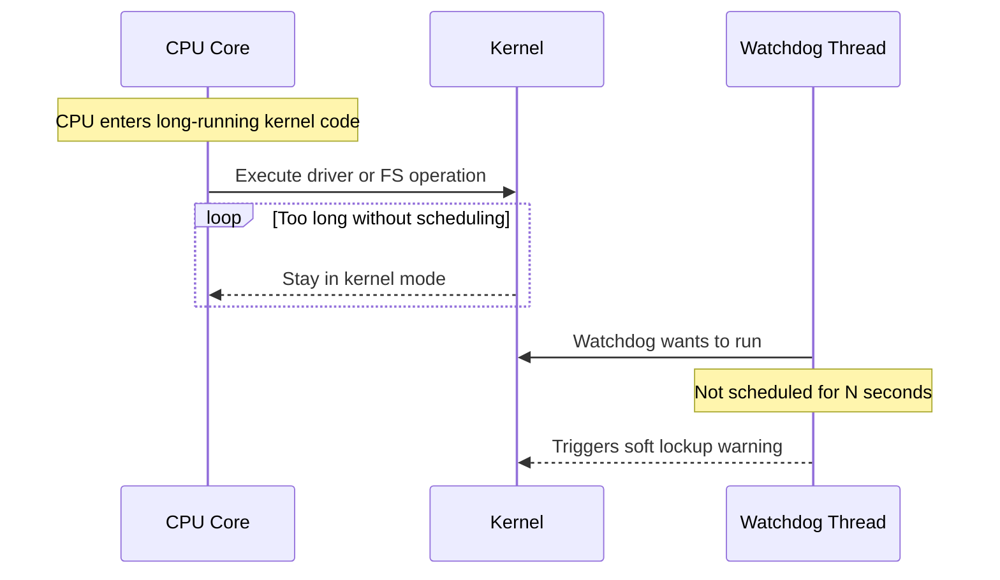

# 2.4 Kernel Lockups & Stall Diagnostics

This document focuses on what happens when CPUs appear “stuck”: the kernel reports soft lockups, the system feels frozen, or latencies spike unexpectedly. You will learn to recognize symptoms, read diagnostic messages, and perform first-response analysis.

We will stay at the level appropriate for sysadmins and SREs, emphasizing observable behavior rather than kernel internals.

---

## 2.4.1 Key Terms

- **Soft lockup**  
  A condition where a CPU appears stuck in kernel mode for too long without scheduling other tasks; detected by kernel watchdogs.

- **Hard lockup**  
  A more severe stall where interrupts are not being handled on a CPU for an extended period.

- **Watchdog**  
  A monitoring mechanism (often per-CPU) that checks if the kernel is still making progress.

- **CPU starvation**  
  A situation where some tasks cannot get CPU time because others dominate the runqueue.

- **Spinlock / busy-waiting**  
  A loop that repeatedly checks a condition while holding the CPU, potentially starving other work.

- **RCU stall**  
  A specific class of stall in the Linux kernel’s Read-Copy-Update subsystem, visible through `dmesg`.

These terms mainly surface in kernel logs (`dmesg`) and in user-visible symptoms such as freezes and severe latency spikes.

---

## 2.4.2 Symptoms of Lockups and Severe Stalls

In production, you rarely start from “soft lockup detected” and work backwards. More often you hear:

- “SSH sessions hang intermittently.”
- “The monitoring agent stopped reporting for 30 seconds.”
- “Disk latency graphs show sharp spikes with no increase in I/O volume.”

Observable signs include:

- Very high load average with low user-facing throughput.
- One or more CPUs pegged at 100% in `mpstat -P ALL 1`.
- Unresponsive shell or delayed keystrokes.
- Kernel messages in `dmesg` about soft lockups or RCU stalls.

Your first job is to distinguish between:

- **Normal** high load under legitimate workload.
- **Abnormal** stalls where work stops making progress.

---

## 2.4.3 Soft Lockups and Kernel Watchdogs

Linux includes watchdog threads that periodically check if each CPU is still scheduling tasks. If a CPU spends too long in kernel code without rescheduling, the watchdog may log a **soft lockup**.

Example `dmesg` snippet:

```text
soft lockup - CPU#3 stuck for 23s! [kworker/3:1:12345]
CPU: 3 PID: 12345 Comm: kworker/3:1
Call Trace:
 ...
```

Interpretation:

- CPU 3 did not schedule the watchdog thread for ~23 seconds.
- A kernel worker (`kworker/3:1`) likely ran continuously in kernel mode.

Common high-level causes:

- Long-running kernel operations that fail to yield (e.g., certain drivers, heavy filesystem operations).
- Excessive interrupt or softirq handling on a single CPU.
- Bugs causing infinite loops or very long loops in kernel code.

As a sysadmin/SRE, you typically cannot fix the kernel code yourself, but you *can*:

- Capture the `dmesg` logs and call traces.
- Correlate with workload, configuration, and recent changes.
- Escalate with a clear, evidence-backed report.

---

## 2.4.4 Hard Lockups and When the System “Completely Freezes”

**Hard lockups** are more severe: interrupts themselves stop being handled. Symptoms include:

- System appears completely frozen; keyboard and mouse do not respond.
- Monitoring stops reporting from the affected node.
- The machine may require a hardware reset.

In some environments, hardware or firmware-level watchdogs can detect such a state and trigger an automatic reboot.

From a Linux CLI perspective, your visibility is limited *after* a hard lockup, but you can:

- Check logs after reboot for previous warnings.
- Look for patterns of high softirq or interrupt activity before the event.
- Capture `journalctl -k` and `/var/log/*` to support root-cause analysis.

---

## 2.4.5 CPU Starvation vs Kernel Lockup

Not every freeze is a kernel lockup. Often, user-space tasks are simply **starved of CPU**, for example:

- A runaway process spins in user space at 100% CPU on multiple cores.
- Misconfigured limits allow hundreds of CPU-hungry workers to compete for a small number of cores.

In these cases:

- The kernel is *making progress*; schedulers and interrupts still run.
- But interactive tasks (shells, SSH, monitoring agents) get very little CPU time.

Distinguishing factors:

- **CPU starvation**  
  - High `%us` or `%sy` in `top`.
  - Many runnable tasks (`r` column in `vmstat`) and high context-switch rates.
  - System remains somewhat responsive, though sluggish.

- **Kernel lockup**  
  - `dmesg` shows soft lockup or RCU stall messages.
  - The system may completely stop responding for tens of seconds or require a reboot.

Correct diagnosis guides response:

- For CPU starvation: adjust workload, limits, or priorities.

- For suspected lockups: collect logs, consider kernel and driver updates, and coordinate with OS/vendor support.

---

## 2.4.6 First-Response Diagnostics During a Stall

When you suspect a stall but still have partial access, prioritize *lightweight* commands so you do not worsen the situation.

Useful commands:

- **Check kernel messages**

  ```bash
  dmesg | tail -n 50
  ```

  Look for `soft lockup`, `RCU stall`, or driver warnings.

- **Check per-CPU usage**

  ```bash
  mpstat -P ALL 1 5
  ```

  Identify CPUs that are consistently 100% busy, and whether time is `%us`, `%sy`, `%si`, or `%irq`.

- **Check runqueue pressure**

  ```bash
  vmstat 1 5
  ```

  Focus on `r` (runnable tasks) and `cs` (context switches per second). A very high `r` with high `%us/%sy` often indicates CPU starvation rather than a lockup.

- **Identify the hottest processes**

  ```bash
  ps -e -o pid,ppid,comm,psr,pcpu --sort=-pcpu | head
  ```

  Look for processes pinned to specific CPUs or kernel threads like `ksoftirqd/N` consuming a lot of CPU.

Capture outputs and timestamps; they are invaluable when investigating later.

---

## 2.4.7 Visualizing a Soft Lockup Scenario

This simplified Mermaid diagram shows how a soft lockup can arise:



The key idea is that the watchdog is just another task that needs CPU time. If it cannot run, the kernel concludes that something is wrong.

---

## 2.4.8 Hands-On Exercise: Simulating CPU Starvation (Safe Approximation)

> **Warning:** Run only on a non-production system. This exercise creates heavy CPU load and can make the machine sluggish for a short time.

To illustrate CPU starvation *without* triggering actual kernel lockups, use the script `scripts/section02-04-lockup-and-stall-demo.sh`.

Run it as:

```bash
bash scripts/section02-04-lockup-and-stall-demo.sh
```

While it runs, in another terminal:

- Run `vmstat 1` and observe:
  - `r` grows (more runnable tasks).
  - `cs` increases (more context switches).

- Run `mpstat -P ALL 1`:
  - See all (or many) CPUs near 100% `%us`.

- Try typing into a shell window:
  - Observe any lag; this illustrates CPU starvation of interactive tasks.

When you stop the script, the system should recover quickly with no kernel warnings.

This scenario is intentionally *less* severe than a true kernel lockup, but it builds intuition for what it feels like when CPUs are overcommitted.

---

## 2.4.9 When to Escalate and What to Capture

Repeated soft lockup or RCU stall messages, or irregular but severe freezes, usually warrant escalation to OS or kernel experts. Before rebooting (if possible), collect:

- `dmesg` output around the time of the event.
- `journalctl -k -b` from the affected boot.
- Snapshots of `vmstat 1`, `mpstat -P ALL 1`, and `ps` showing hot processes.
- Hardware details (`lscpu`, `lsblk`, NIC models) and driver versions.

Providing this data greatly speeds up root-cause analysis and avoids “it froze, we rebooted, that’s all we know”.

---

## 2.4.10 Beginner Checklist

- [ ] I can explain the difference between soft lockups, hard lockups, and CPU starvation.
- [ ] I can recognize kernel soft lockup warnings in `dmesg` and understand their basic meaning.
- [ ] I can use `mpstat -P ALL` and `vmstat` to distinguish heavy but normal CPU load from pathological stalls.
- [ ] I can run `section02-04-lockup-and-stall-demo.sh` safely on a test system and relate my observations to CPU starvation.
- [ ] I know which logs and command outputs to capture before escalating suspected kernel lockup issues.
